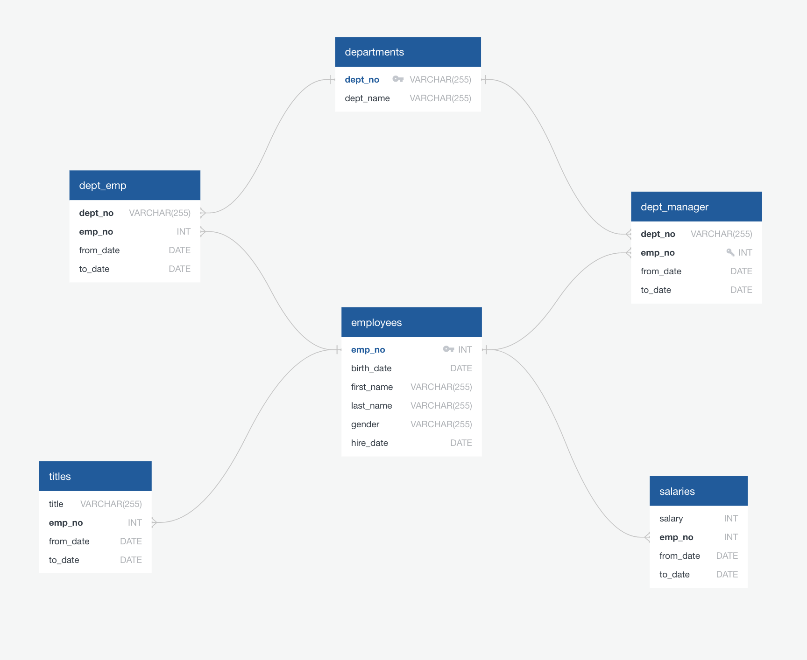

# Employee Data: Modeling, Engineering, Analysis, Visualization and Findings

* Please add your own configuration to the  attacked json file prior to running the  .ipynb for the visualization and analysis breakdown.  

#### Data Modeling
I modeled my Database using Quick DBD: 
```
employees
-
emp_no PK INT
birth_date DATE 
first_name VARCHAR(255)
last_name  VARCHAR(255)
gender VARCHAR(255)
hire_date DATE


departments
-
dept_no PK VARCHAR(255)
dept_name VARCHAR(255)


dept_emp
-
dept_no VARCHAR(255) FK >- departments.dept_no
emp_no INT FK >- employees.emp_no 
from_date DATE
to_date DATE


dept_manager
-
dept_no VARCHAR(255) FK >- departments.dept_no 
emp_no INT  FK >- employees.emp_no UNIQUE
from_date DATE
to_date DATE


salaries
-
salary INT
emp_no INT FK >- employees.emp_no 
from_date DATE
to_date DATE 

titles
-
title VARCHAR(255)
emp_no INT  FK >- employees.emp_no 
from_date DATE
to_date DATE
```
Here is the diagram:  


#### Data Engineering
You may find the sql schema here: 


#### Data Analysis
You may find the analysis queries here:  


## Visualization and Findings 
This is the ipynb file showing analysis and visualization of the data after loading it from PostgreSQL with SQLAlchemy  and json config:  


 